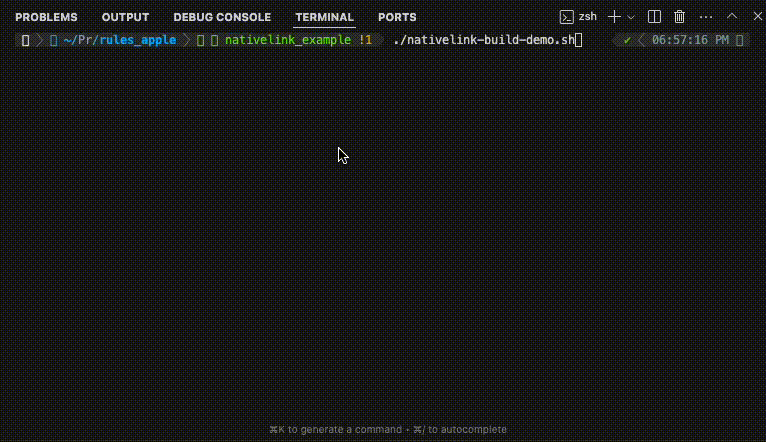
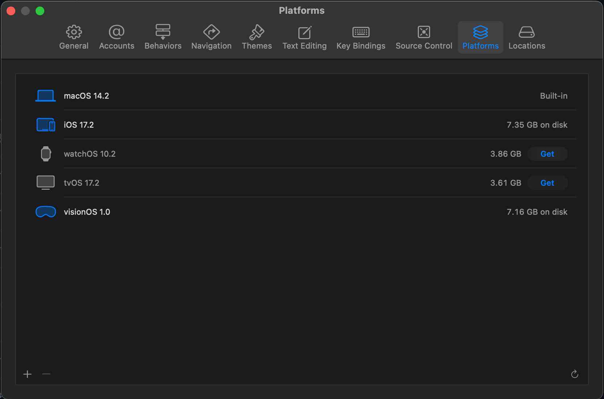

# Remote Caching and Execution of Apple Projects using [Bazel](https://bazel.build)

[](https://nativelink.com/)

This repository contains a suite of example projects that use Apple Silicon and Bazel, such as visionOS, iOS, and MacOS.



*Notice the difference in speed of the builds after NativeLink kicks in on the second run.*

## The NativeLink Difference

Using NativeLink to build these Apple projects can greatly benefit in efficiency and development cycles by using NativeLink for remote caching and execution. NativeLink is also more representative of a production environment.

We have also added the [visionOS-example](https://github.com/IvanCampos/visionOS-examples) from Ivan Campos in order to highlight the value of the tool in building software that utilizes Apple's new custom AI chips.

> [!WARNING]
> **The visionOS, iOS, and other simulators must be installed in the platforms section of your XCode settings before proceeding.**
> 
> 
>
> [**Platform Install Instructions**](https://developer.apple.com/documentation/xcode/installing-additional-simulator-runtimes)
>
> The client build request must be done from macOS or else it won't work.

## Setting up Apple Projects with Bazel using Rules_Apple

These rules handle the linking and bundling of applications and extensions
(that is, the formation of an `.app` with an executable and resources,
archived in an `.ipa`). Compilation is still performed by the existing
[`objc_library` rule](https://bazel.build/reference/be/objective-c#objc_library)
in Bazel, and by the
[`swift_library` rule](https://github.com/bazelbuild/rules_swift/blob/master/doc/rules.md#swift_library)
available from [rules_swift](https://github.com/bazelbuild/rules_swift).

If you are looking for an easy way to build mixed language frameworks, check out [rules_ios](https://github.com/bazel-ios/rules_ios).

## Reference documentation

[Click here](https://github.com/bazelbuild/rules_apple/tree/master/doc)
for the reference documentation for the rules and other definitions in this
repository.

## Quick setup

Copy the latest `MODULE.bazel` or `WORKSPACE` snippet from [the releases
page](https://github.com/bazelbuild/rules_apple/releases).

## Examples

Minimal example:

```python
load("@build_bazel_rules_apple//apple:ios.bzl", "ios_application")
load("@build_bazel_rules_swift//swift:swift.bzl", "swift_library")

swift_library(
    name = "MyLibrary",
    srcs = glob(["**/*.swift"]),
    data = [":Main.storyboard"],
)

# Links code from "deps" into an executable, collects and compiles resources
# from "deps" and places them with the executable in an .app bundle, and then
# outputs an .ipa with the bundle in its Payload directory.
ios_application(
    name = "App",
    bundle_id = "com.example.app",
    families = [
        "iphone",
        "ipad",
    ],
    infoplists = [":Info.plist"],
    minimum_os_version = "15.0",
    deps = [":MyLibrary"],
)
```

See the [examples](https://github.com/bazelbuild/rules_apple/tree/master/examples)
directory for sample applications.

## Configuring your Bazel Project with Nativelink

### Replace these with the `.bazelrc` config from [NativeLink Cloud](https://app.nativelink.com) in the Quickstart to use NativeLink

```bash
build --remote_cache=grpcs://cas-[YOUR_NAME_HERE].build-faster.nativelink.net
build --remote_header=x-nativelink-api-key=[YOU_NATIVELINK_API_KEY]
build --remote_timeout=600
```

## Supported bazel versions

rules_apple and rules_swift are often affected by changes in bazel
itself. This means you generally need to update these rules as you
update bazel.

You can also see the supported bazel versions in the notes for each
release on the [releases
page](https://github.com/bazelbuild/rules_apple/releases).

Besides these constraints this repo follows
[semver](https://semver.org/) as best as we can since the 1.0.0 release.

| Bazel release | Minimum supported rules version | Final supported rules version | Supporting Branch |
|:-------------------:|:-------------------:|:-------------------------:|:-------------------------:|
| 8.x (most recent rolling) | 2.* | current | `master` |
| 7.x | 2.* | current | `master` |
| 6.x | 2.* | current | `master` |
| 5.x | 0.33.0 | 1.* | `bazel/5.x` |
| 4.x | 0.30.0 | 0.32.0 | N/A |
| 3.x | 0.20.0 | 0.21.2 | N/A |
